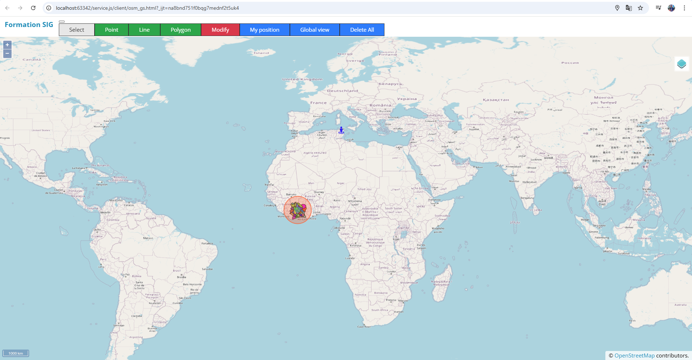
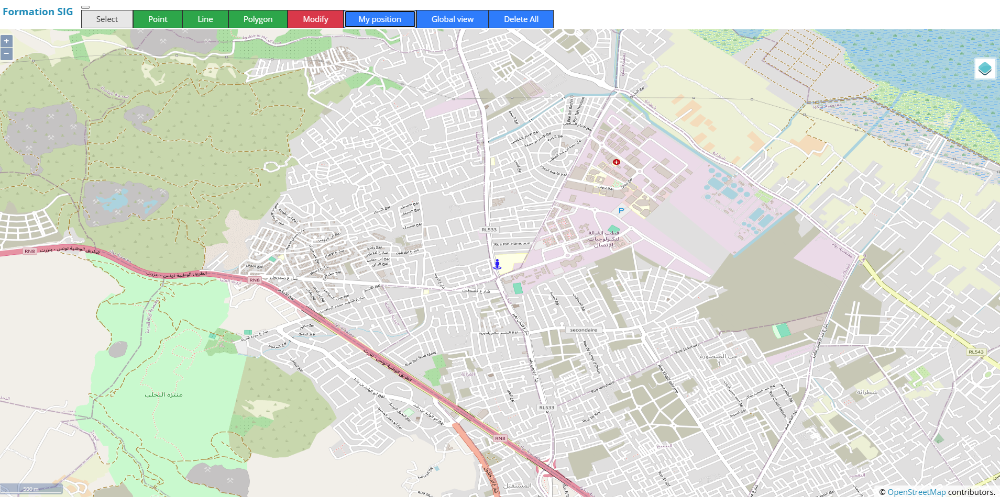
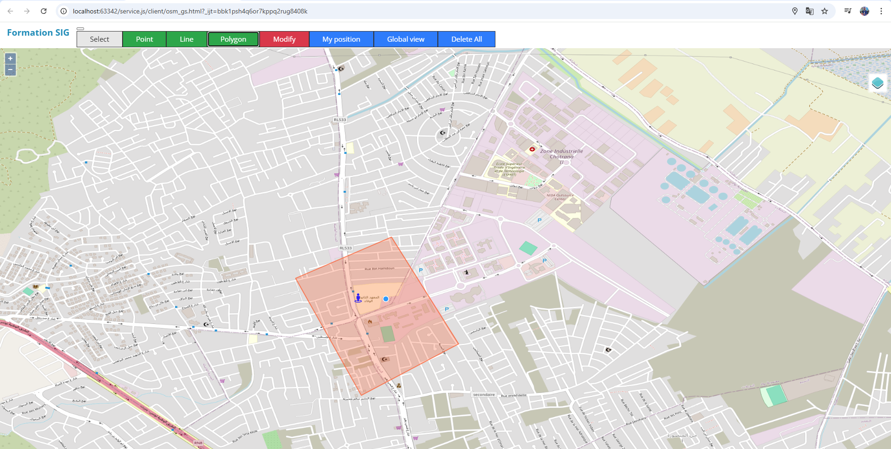

# Interactive-GIS-Mapping-using-JavaScript-with-GeoServer-and-OpenLayers
## Context :
Welcome to the OpenLayers GIS Application! This project combines **GeoServer**, **OpenLayers**, and **JavaScript** to create an interactive Geographic Information System (GIS) tool for visualizing and managing geographic data. 
This application provides tools for geographic data visualization and annotation. 
It can later be expanded to support important use cases such as:

- **Urban Planning**: Design and analyze urban infrastructure and land use.
- **Disaster Management**: Monitor, plan, and respond to natural and man-made disasters.

## Goals :
The application is designed to:
1. Enable visualization of pre-configured geographic layers from GeoServer.
2. Allow users to interact with and annotate maps using points, lines, and polygons.
3. Facilitate data persistence by saving drawn features to a PostgreSQL database.
4. Provide tools for:
   - Real-time geolocation.
   - Scale display.
   - Administrative boundary exploration.

---

## Prerequisites :
⚠ **Important Note** ⚠  
**Before proceeding with this tutorial, ensure you have completed the GeoServer setup steps provided in the **`PDF_complete_work_tutorial` folder** 📂. This README file focuses on the remaining steps required to set up and run the application.**

Ensure the following are installed and configured on your system:
- **npm** and **Node.js** for managing dependencies and running the server.
- **GeoServer** for serving geographic data layers.
- **PostgreSQL** for storing geographic data.

---

## Setting up the Server :
1. Navigate to the `server` directory.
2. Run the following commands to install dependencies and start the server:
   ```bash
   npm install
   node service.js

## PostgresSQL Configuration :
Check that PostgreSQL is running on the port 5432. to match the port in the code.

---

## Previews :

1. **Displaying the Global View of the Map**
   

2. **Displaying the local position**
   

3. **Displaying Shapes Existing in the Database**
   

## Disclaimer :
This work was done in the context of an academic mini-project at SUPCOM.
